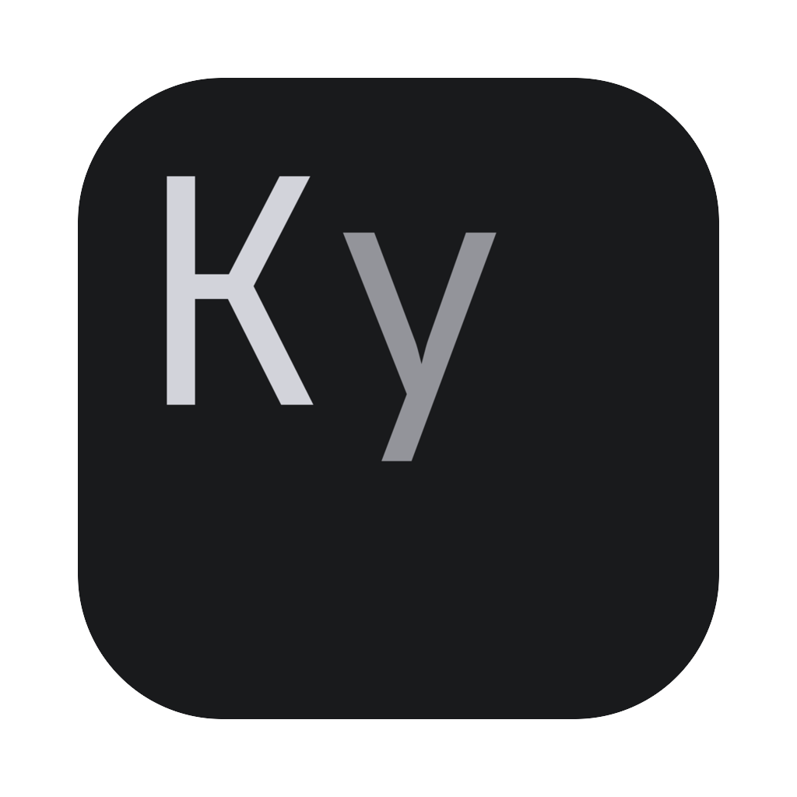
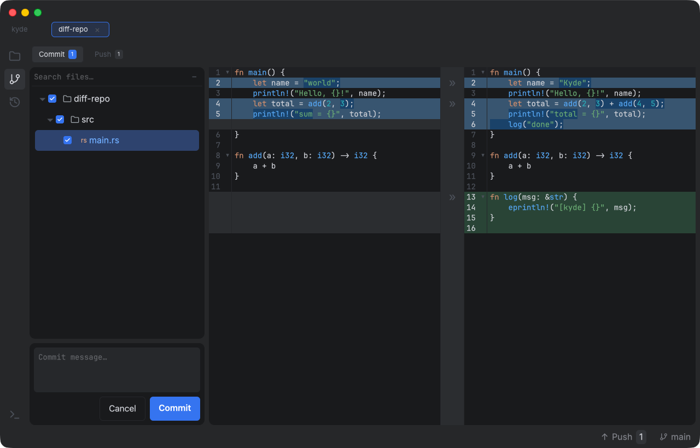
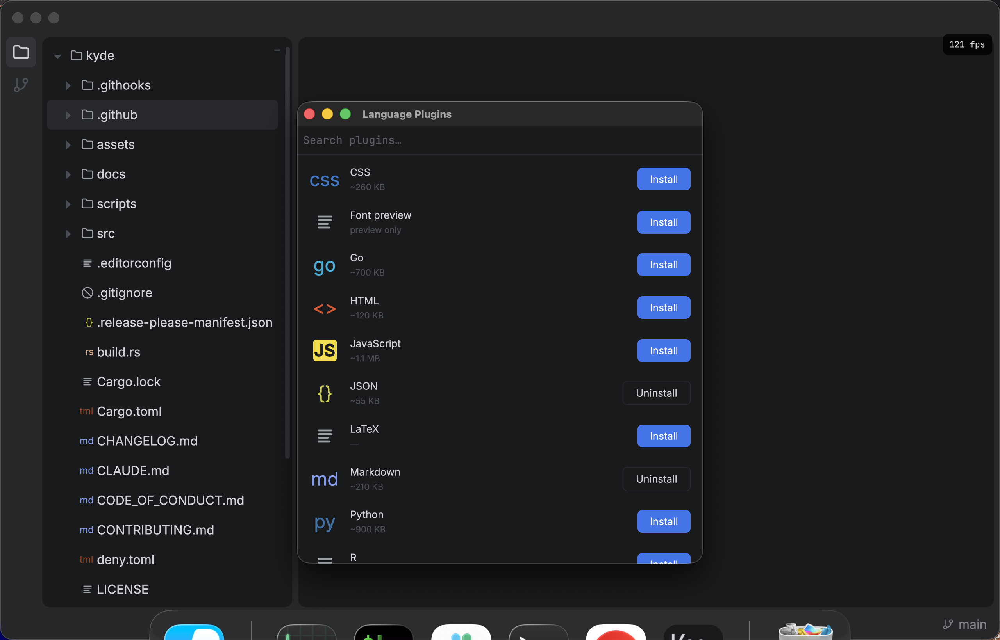
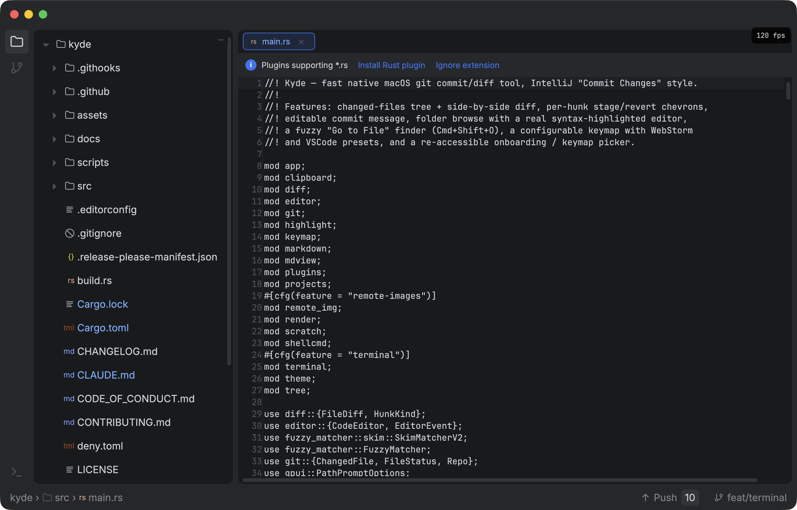
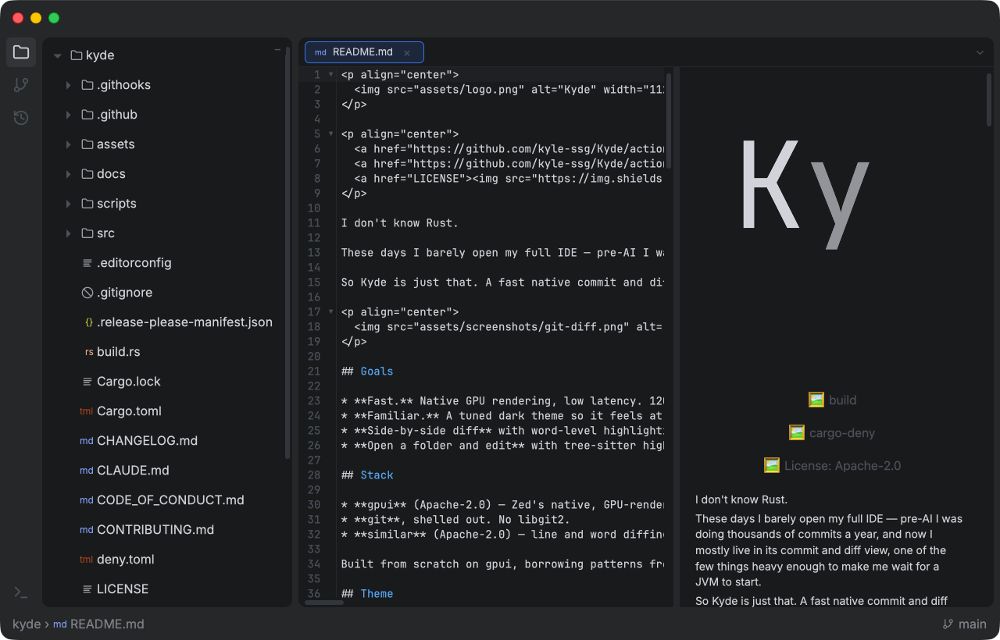
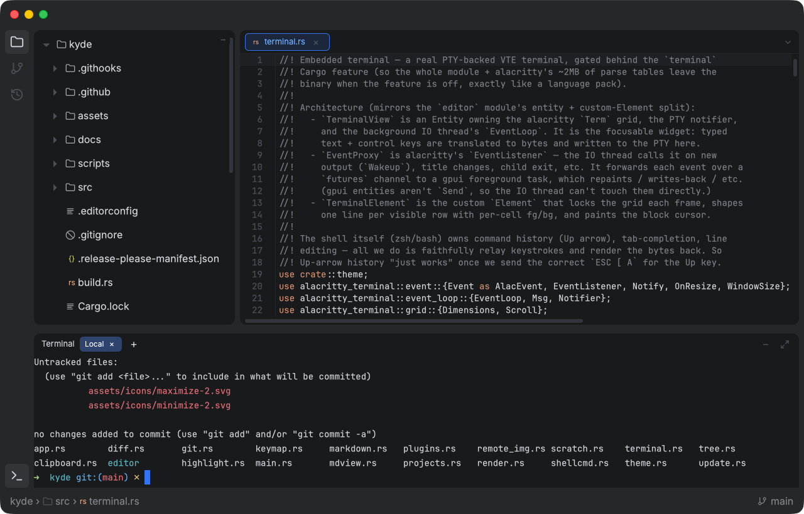
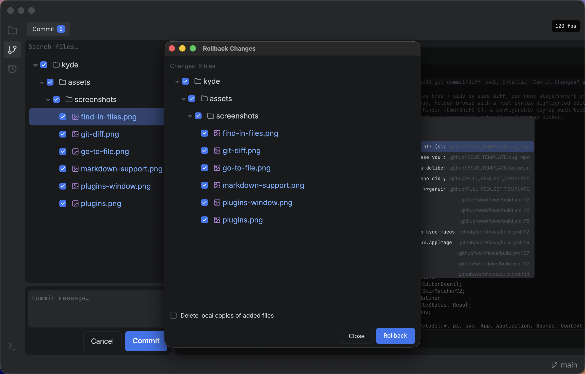
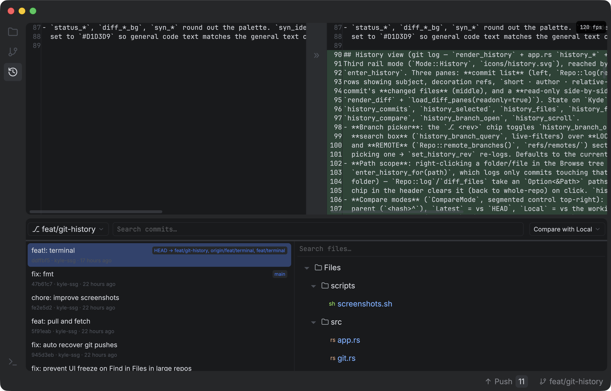
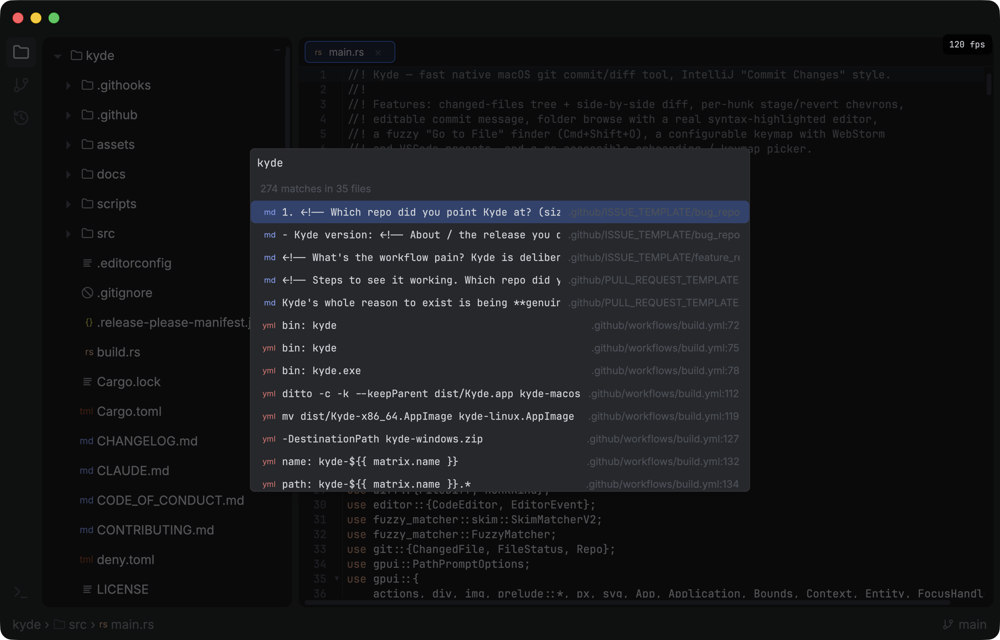
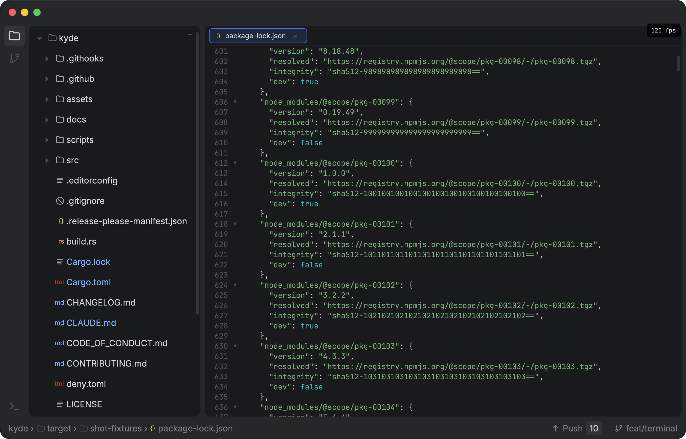

<p align="center">
  
</p>

<p align="center">
  <a href="https://github.com/kyle-ssg/Kyde/actions/workflows/build.yml"></a>
  <a href="https://github.com/kyle-ssg/Kyde/actions/workflows/cargo-deny.yml"></a>
  <a href="LICENSE"></a>
</p>

I don't know Rust.

These days I barely open my full IDE — pre-AI I was doing thousands of commits a year, and now I mostly live in its commit and diff view, one of the few things heavy enough to make me wait for a JVM to start.

So Kyde is just that. A fast native commit and diff code editor — a Git client for macOS, Linux and Windows.

<p align="center">
  
</p>

<p align="center">
  <em>~120fps scrolling a 37k-line <code>package-lock.json</code> — viewport virtualization + off-thread highlighting.</em>
</p>

## Goals

* **Fast.** Native GPU rendering, low latency. 120fps even on large files.
* **Familiar.** A tuned dark theme so it feels at home to anyone who's lived in a modern IDE.
* **Side-by-side diff** with word-level highlighting and a center gutter to stage/revert hunks — `git add -p`, made visual.
* **Open a folder and edit** with tree-sitter highlighting.

## Stack

* **gpui** (Apache-2.0) — Zed's native, GPU-rendered GUI framework. No web, no Electron.
* **git**, shelled out. No libgit2.
* **similar** (Apache-2.0) — line and word diffing.

Built from scratch on gpui, borrowing patterns from existing editors but not their code.

## Theme

A hand-tuned dark palette, configurable at runtime via `~/.config/kyde/theme.json`.

## Features

### Projects

* **Landing view** when no project is open: searchable recents with branch + path, persisted to `~/.config/kyde/projects.json`.
* **Open** / **New Project** via the native folder picker.

### Code — browse & edit

* **Folder tree** — expandable, resizable, file-type icons, git-status colors.
* **Text editor** — selection, undo/redo, copy/cut/paste, Tab/Shift-Tab indent, ⌘-backspace, line numbers, current-line highlight, IME, auto-save.
* **Find & replace** — `⌘F` find (`⌘G`/`⇧⌘G` to cycle), `⌘R` replace.
* **Editor tabs** that scroll and follow the active file.
* **Image preview** for PNG/JPG/GIF/WebP.
* **Syntax highlighting** via tree-sitter, installed on demand from a built-in **Language Plugins** manager. Packs: **TypeScript/TSX, JavaScript, Rust, JSON, Markdown, Shell, CSS, SCSS, YAML, TOML, Python, HTML, Go, R, LaTeX** — plus always-on `.env` and `.gitignore` highlighters, and a **Font preview** plugin. Each pack is also a Cargo feature, so a build can ship only the grammars it wants ([details](#build)).
* **Code folding** for grammar-backed languages.
* **Markdown preview** — a live rendered pane alongside the editor.

<p align="center">
  
</p>

<p align="center">
  
</p>

<p align="center">
  
</p>

### Terminal

* **Embedded multi-tab terminal** — a real PTY-backed shell (alacritty's VTE engine),
  bottom-docked, toggled with `⌃\``. Full color, scrollback, resize, multiple tabs.
* **Mouse select + copy** (`⌘C`), **paste** (`⌘V`, bracketed-paste aware), **`⌘`-click URLs**.
* History (`↑`), tab-completion, line-editing all work — it's your real shell.
* Optional: drop it entirely with `--no-default-features` (the `terminal` Cargo feature)
  for a ~2MB-lighter binary.

<p align="center">
  
</p>

### Git — commit, diff, branches

* **Commit view**: changed-files list + an editable side-by-side diff — base on the left, live working copy on the right, both highlighted.
* **Stage / revert** per hunk from the center gutter, or whole files; commit via the message box.
* **Rollback** in a native window — checkbox tree, optional deletion of added files, right-click for diff.
* **Push** when ahead of upstream (status-bar button + context menu).
* **Branch switcher** — searchable tree, `/` as folders, Recent / Local roots.
* **History** — commit log for any branch, with the selected commit's changed files and a read-only diff that compares vs the parent, latest, or your local working tree.
* **File management** from the tree — New File, Rename, Delete (with confirm).

<p align="center">
  
</p>

<p align="center">
  
</p>

### Search & navigation

* **Go to File** (`⌘⇧O` / `⌘P`) and **Find Action** (`⌘⇧A`) fuzzy finders.
* **Find in Files** (`⌘⇧F`) — full-text content search across the repo (`git grep`), jump straight to a match.
* **Scratch files** — throwaway buffers under a "Scratches" folder.
* **Breadcrumbs** in the status bar.

<p align="center">
  
</p>

### Look & feel

* **Islands layout** — rounded panels, draggable dividers, activity rail, native title bar (double-click to zoom), status bar.
* **Native menu bar** — Settings, FPS monitor toggle, Quit.
* **App icon** from the bundled logo.

### Keymap & configuration

* **WebStorm** / **VSCode** presets with per-action overrides in `~/.config/kyde/keymap.json`.
* **Onboarding keymap picker** on first launch, reopenable via Settings.
* **Install shell command** — optionally symlinks `ky` into `~/.local/bin`. No shell-rc editing, no sudo.

## Install

Grab the latest build for your platform from the [Releases](../../releases) page.

**macOS** — download `kyde-macos.zip`, unzip, and drag **Kyde.app** to `/Applications`. The app isn't code-signed yet, so the first launch is blocked by Gatekeeper — right-click it and choose **Open** (once), or clear the quarantine flag:

```sh
xattr -dr com.apple.quarantine /Applications/Kyde.app
```

**Linux** — download `kyde-linux.AppImage`, make it executable, and run it:

```sh
chmod +x kyde-linux.AppImage
./kyde-linux.AppImage
```

**Windows** — download `kyde-windows.zip`, unzip, and run `kyde.exe`.

Or build from source — see [Build](#build). On macOS, `./scripts/bundle-macos.sh` produces `dist/Kyde.app` you can drag to `/Applications`.

## Usage

Launch with no arguments for the Projects view, or point it at a repo:

```sh
cargo run -- /path/to/repo
```

First-run setup offers to **install a `ky` shell command** (a symlink into `~/.local/bin` — no shell-rc editing, no `sudo`); leave it ticked and you can open Kyde from any terminal:

```sh
ky                 # Projects view
ky /path/to/repo   # open a repo directly
```

Default shortcuts (WebStorm → VSCode):

* Go to File: `⌘⇧O` → `⌘P`
* Find Action: `⌘⇧A`
* Find / Replace in file: `⌘F` / `⌘R`
* Save: `⌘S`
* Commit: `⌘K` → `⌘⏎`
* Commit view: `⌘9` → `⌃⇧G`
* Browse view: `⌘1` → `⌘⇧E`
* New Scratch: `⌘⇧N`
* Settings: `⌘,`

## Build

Needs Rust 1.96+ and (on macOS) Apple's Metal Toolchain, which gpui uses to compile its shaders — if a clean machine errors with "missing Metal Toolchain", run `xcodebuild -downloadComponent MetalToolchain`.

```sh
cargo build --release          # full — every language grammar baked in (default)
cargo test                     # logic, perf guards, and headless-gpui smoke tests
```

Each language pack is a Cargo feature, so unused grammars can be dropped from the binary entirely (smaller image + resident RAM):

```sh
cargo build --release --no-default-features --features rust,json,toml
```

## Performance

Large files stay smooth via **viewport virtualization** (only on-screen rows are shaped each frame) and **async highlighting** (big files open instantly as plain text, then highlight off-thread). A 37k-line `package-lock.json` scrolls at ~120fps.

<p align="center">
  
</p>

Guarded by `perf_*` time-budget tests, headless-gpui smoke tests (render every screen, fail on any panic), and a toggleable on-screen FPS monitor.

## Known limitations / next

* **Prebuilt releases are macOS-only.** I develop on macOS and wouldn't actively test Linux/Windows, so I only ship a signed + notarized macOS build rather than binaries I can't stand behind. The code itself is cross-platform — gpui runs on all three, and Linux/Windows packaging already exists in `scripts/` (just unwired from the release). Re-enabling them is a **good first issue** for a contributor who runs those platforms. Until then, Linux/Windows users can `cargo build --release`.
* No soft-wrap or caret-follow scrolling yet. The editor uses a flat `String`; a rope-based buffer comes later for very large edits.
* File watching currently refreshes on focus only. Live updates will likely use `notify`.

## Contributing

If you open a PR, please be kind — explain the idiomatic way, don't just dunk on my `.clone()`s. I'll read every comment and quietly Google what a lifetime is.

If the feature adds a lot of bloat, it should be a plugin.
